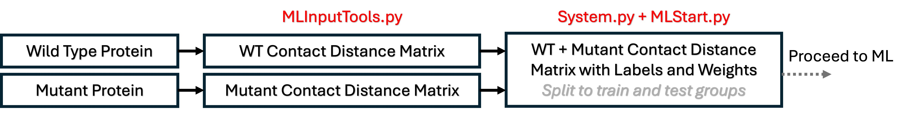

# XML-Measuring-Dynamics

The goal of this project is to compute atomic differences between similar biochemical systems via machine learning. 

## Table of Contents

- [Overview](#overview)
- [Features](#features)
- [Installation](#installation)
- [Usage](#usage)
- [todo](#todo)


## Overview

The goal of this project is to compute atomic differences between similar biochemical systems via machine learning. 

## Features

- Generate feature sets (contact distance maps) from GROMACS trajectories (.trr)
- Generate "machine learning ready" datasets from feature sets
- Utilize random forest and permutation feature importance to highlight importance differences between similar systems 


## Installation

Clone the repository:

```bash
git clone https://github.com/HeydenLabASU-collab/XML-Measuring-Dynamics.git
cd XML-Measuring-Dynamics
pip3 install -e .
```

## Usage

A sample workflow is provided in `scripts_final/` and is visualized below.


For example, Random Forests + Feature Importance can be used to distinguish atomic differences between simulations of a WT and a mutant protein. The goal of the code is to provide a flexible codebase to 

1. Compute atomic features (System.py)
2. Enable machine learning applications (ML*.py)



## todo

- Add functionality to compute different (position dependent) feature sets
- Add functionality to utilize different ML architechures
- Add functionality to utilize different feature importance strategies
